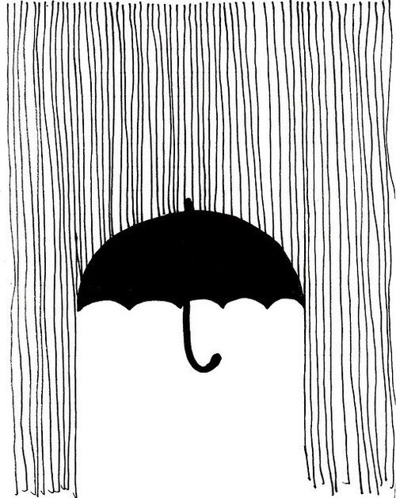

FINAL PROJECT IDEA:

I am going to utlize the sound library to have an animation of falling things (raindrops, hearts, sprinkles etc.) that increase and decrease with the aplitude of the music playing. 

Also I want to have three different songs that you can choose from that "rain" down a distinct thing for each, that mirrors possibly what the song is about. 

I then also want to have a umbrella that follows you mouse's horizontal position and whereever that is the "rain" won't fall under. Somewhat like the picture I included below. 

