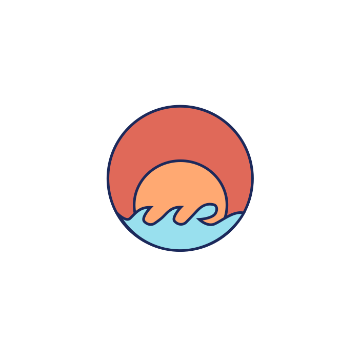

Midterm Project Report

What is the idea?
I wanted to create a personal logo animation that I can embed into my website & therefore show my creative coding abilities to future employers.

Who is it for?
This is mostly for myself to show off another way in which I can use assets I have learned to create something interesting in design and function. I believe it is for potential employers to understand the different skills I possess.

Why does it need to exist?
I mean in the scheme of the world this doesn't necessarily need to exist but it does need to exist in order to show a more interesting way of presenting a logo design. This could in turn make me stand out in a sea of applicants.

Where would it be displayed?
This will displayed within my own website, either on the first page that loads or on the about me page.

What does it need to do/have?
- Components need to load in a certain order & layered in the correct way
- Creating a fade in/out effect
- Make it so mouse press interactions only execute after a certain point
- Mouse press cycles through different color combinations of my logo
- Let users restart the animation with a key press

What did I struggle with?
I had a hard time trying to create the fade in & out effect I wanted on the different wave aspects. I attempted to use the tint property but found that it slowed down the speed of the animation. I had to instead use a series of pngs with increasing or decreasing transparency values & make the program run through those with the help of millis.

Pseudo code:
1. First I coded the movement of the red circle to drop down from above. 
2. Then when the red circle is close to being in its final position I triggered the big waves to rise.
3. Once they rise I triggered a variable to change to true that would make the big waves fade out and the small waves to fade in. 
4. This fade is made with two sequences of pngs with decreasing & increasing transparency values respectively and run based on millis values. 
5. Once both fades are complete it triggers the sun to rise from behind the smaller waves. 
6. As the sun moves to its final position it triggers both my first and last name move in from the sides of the canvas from different directions. 
7. When the names are in their final position mouse pressed and key pressed functions are now accessible. 
8. When someone presses the mouse the different color logos will cycle through. 
9. When someone presses any key it will set all of the variables back to their original states/values and therefore cause the animation to run again. 

